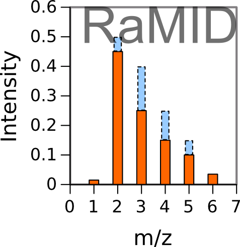

# RaMID
Version: 1.0

## Short description
R-program to read CDF files, created by mass spectrometry machine, and evaluate the mass spectra of 13C-labeled metabolites 

## Description

Here a docker image of RaMID can be created. RaMID is a computer program designed to read the machine-generated files saved in netCDF format containing registered time course of m/z chromatograms. It evaluates the peaks of mass isotopomer distribution (MID) making them ready for further correction for natural isotope occurrence. To create the docker image the github repository "https://github.com/seliv55/RaMID" is used.

## Key features

- primary processing of 13C mass isotopomer data obtained with GCMS

## Functionality

- Preprocessing of raw data
- initiation of workflows

## Approaches

- Isotopic Labeling Analysis / 13C
    
## Instrument Data Types

- MS

## Data Analysis

- RaMID reads the CDF files presented in the working directory, and then
- separates the time courses for selected m/z peaks corresponding to specific mass isotopomers;
- corrects baseline for each selected mz;
- choses the time points where the distribution of peaks is less contaminated by other compounds and thus is the most representative of the real analyzed distribution of mass isotopomers;
- evaluates this distribution, and saves it in files readable by MIDcor, a program, which performs the next step of analysis, i.e. correction of the RaMID spectra for natural isotope occurrence, which is necessary to perform a fluxomic analysis.
- correction for H+ loss produced by electron impact, natural occurring isotopes, and peaks overlapping

## Screenshots

- screenshot of input data (format Metabolights), output is the same format with one more column added: corrected mass spectrum


## Tool Authors

- Vitaly Selivanov (Universitat de Barcelona)

## Container Contributors

- [Pablo Moreno](EBI)

## Website

- N/A

## Git Repository

- https://github.com/seliv55/RaMID

## Installation

- Go to the directory where the dockerfile is.
- Create container from dockerfile:

```
docker build -t ramid:0.1 .
```

Alternatively, pull from repo:

```
docker pull container-registry.phenomenal-h2020.eu/phnmnl/ramid
```

## Usage Instructions

- To run RaMID as a docker image, execute
 
```
docker run -it -v $PWD:/data container-registry.phenomenal-h2020.eu/phnmnl/ramid -i /data/ramidin.csv -o /data/ramidout.csv -z /data/wd.zip
```
 
## Publications

- 
